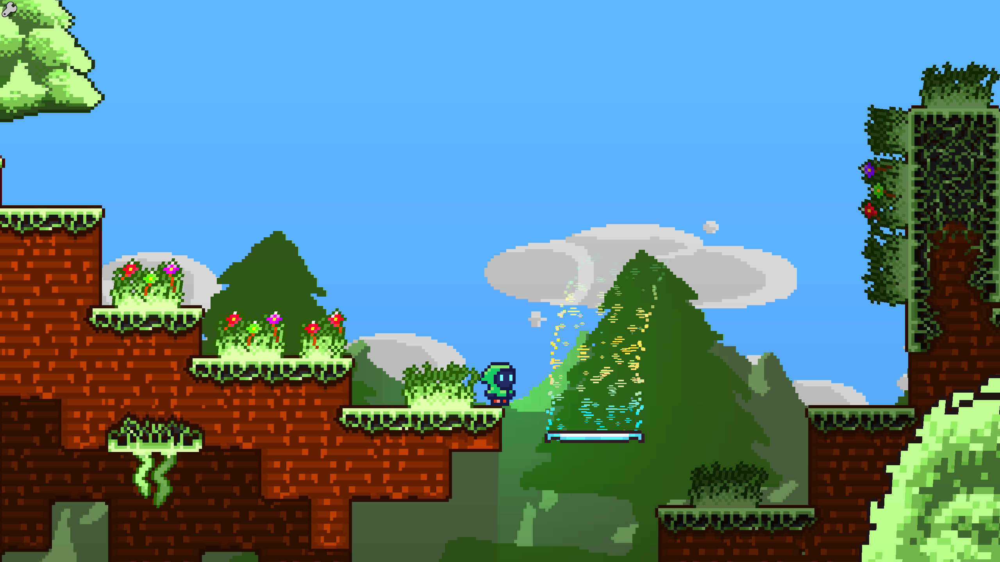
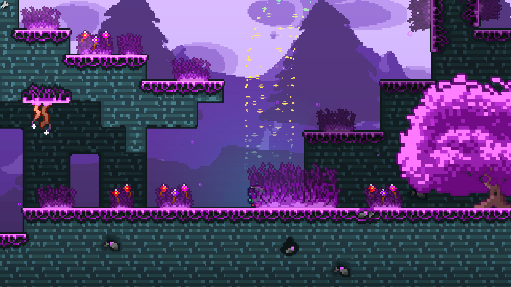
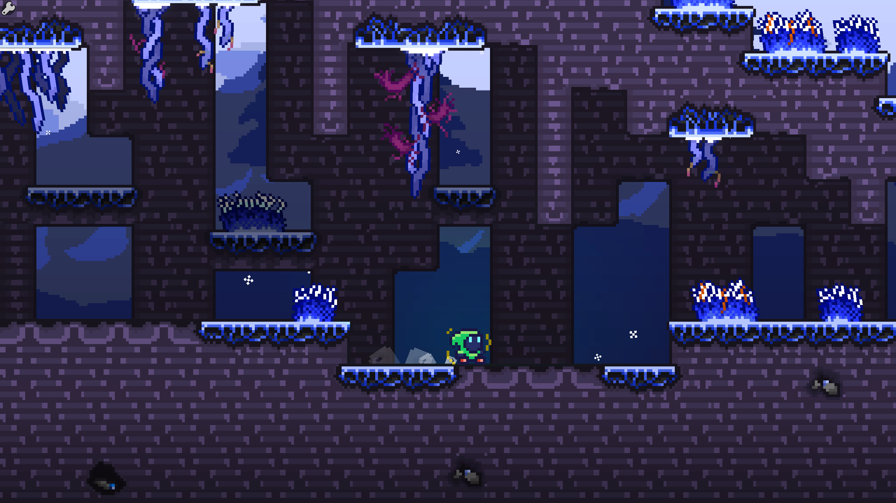
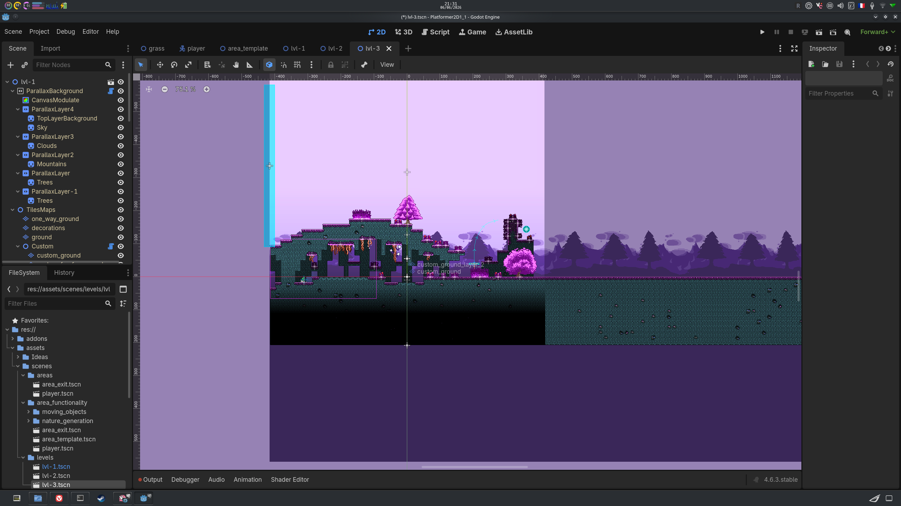
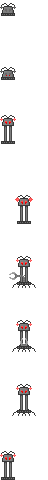

# Plateformer2D game-system

> A 2D platformer with procedural level generation, visual effects and sound design.

*Started in early 2026.*

**UNFINISHED**

---

## THE GAME'S CURRENT STATE IS THE FOLLOWING

**3 biomes · Procedural generation · Color palette customization · Particles and sprites**  
Built with Godot 4 — no additional framework.

---

## Screenshots

| Biome 1 | Biome 2 |
|---|---|
|  |  |

| Biome 3 | Editor Screen |
|---|---|
|  |  |

---

## Features

- **Procedural generation** — levels generated with trees, grass, vines and adaptive tilemaps
- **3 biomes** — variable tilesets and color palettes (GREEN, BLUE, PURPLE…)
- **Particle system** — snow, smoke, trail, leaves, magic
- **Sound design and engine** — footstep sounds per ground type (grass, snow, magic, dirt), jump and wall-standing SFX
- **Zone management** — room system with templates, transitions and bounded camera
- **Moving platforms** — moving objects integrated into levels
- **Shaders** — color modulation and palette swapping for tilemaps
- **Physics system** — A fully original and personalised physics system
- **Handfull of original assets** - all the assets including sound effets, textures, sprites and animations are hand-made by myself

---

## Architecture

```
├── addons/
│   ├── aseprite_importer/       # import .ase/.aseprite → resources Godot
│   ├── ds_inspector/            # dedicated scene inspector
│   ├── markdownlabel/           # markdown rendering in labels
│   ├── nerdfonts/               # Nerd Fonts
│   ├── room_toolkit/            # room management tools
│   └── spritesheetconverter/    # spritesheet splitting
├── assets/
│   ├── scenes/
│   │   ├── area_functionality/  # zone templates, player, environments, platforms
│   │   │   ├── moving_objects/  # moving platforms
│   │   │   └── nature_generation/ # trees, grass, vines
│   │   └── levels/              # test levels (lvl-1, lvl-2, lvl-3)
│   ├── scripts/
│   │   ├── player/              # player control, animation, particles
│   │   ├── world/               # game manager, bounds, light, shadow, exit
│   │   ├── generation/          # tilemaps, grass, trees, procedural vines
│   │   ├── hazards/             # moving platforms
│   │   ├── sounds/              # audio manager, per-tileset sounds
│   │   ├── visual_effects/      # camera effects
│   │   └── shaders/             # modulation, palette swap, trees
│   ├── sprites/
│   │   ├── characters/          # player and enemy sprites
│   │   ├── tiles_sets/          # tilesets, color palettes, sheets
│   │   ├── background/          # parallax backgrounds
│   │   ├── nature_sprites/      # tree, grass, vine textures
│   │   ├── particles/           # particle textures
│   │   └── hazards/             # platforms
│   ├── sounds/
│   │   └── sound_effects/player/# jump, wall-standing SFX
│   └── Ideas/                   # concept art, design notes
├── project.godot                # project configuration
├── icon.svg                     # project icon
└── export_presets.cfg           # export presets
```

The player is controlled as a **CharacterBody2D** with variable jump height, custom physics system, wall detection and ground particles. Levels are built from zone templates (`area_template.tscn`) with procedural generation of natural elements.

Biomes use swappable color palettes via shaders, allowing tileset appearance to vary without duplicating assets.

---

## Controls

| Action | Key |
|--------|-----|
| Move | Z-Q-S-D |
| Jump | SPACE |
| Crouch | DOWN ARROW |
| Stop | Z |

---

## Stack

`Godot 4` `GDScript` `GLSL` — custom shaders, particles, procedural generation.

---

## What's next ?

Future additions are in `/assets/Ideas/` and in my head ;).

| Teasing |
|---|
|  |

---

## Credits

Code, assets, sound effects and game design by **SkylePaf**.
*Started in early 2026.*
